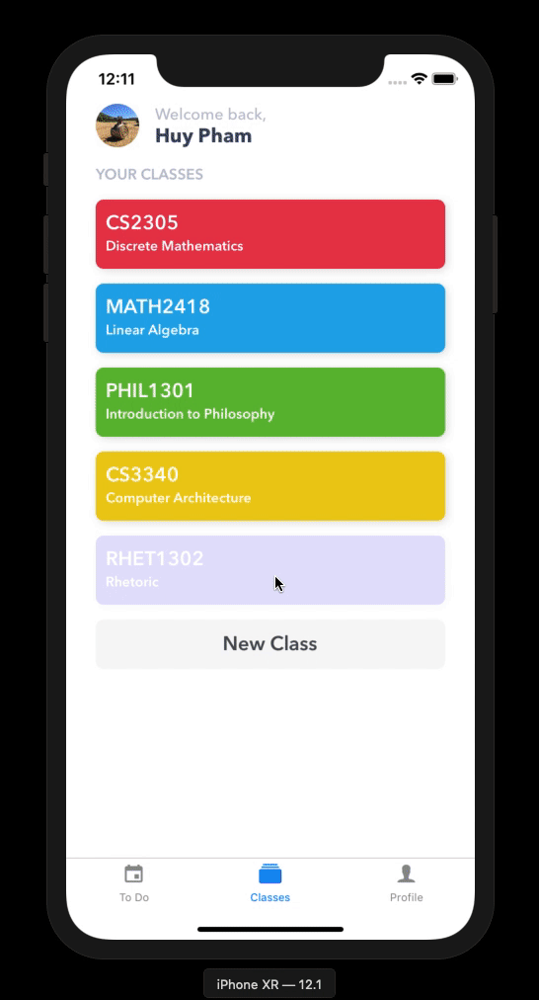

# Smart Lecture Notes
Welcome to the Repo for the Smart Lecture Notes ACM Project!

# Demo

## Goal
The goal of this project is to create an application that will allow the user to take a picture of handwritten notes and make that text searchable, both by words and by headings, graphics, etc.

## Minimum Viable Product
- Application will use the onboard camera to take a picture of notes
- Application will OCR the picture (probably start with typed pages and then move on to handwritten notes)
- Application will parse that picture into headings, graphics, emphasized text, etc.
- Application will tag/name all of the headings, graphics, emphasized text, etc. to make it searchable
> Note: these things will probably happen in this order

## Resources
- Expo [Read More](https://expo.io)
- Google Mobile Vision [Read More](https://developers.google.com/vision/ios/getting-started)